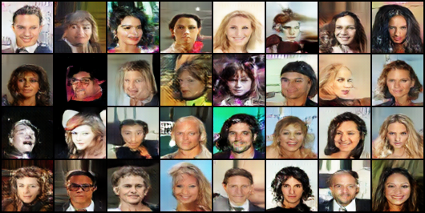
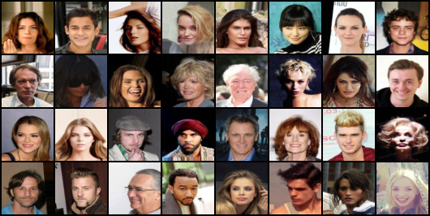

# Deep Convolutional GAN on CelebA

Deep Convolutional Generative Adversarial Network trained on facial images from the CelebA dataset.

## Table of Contents

- [Overview](#overview)
- [Features](#features)
- [Installation](#installation)
- [Usage](#usage)
- [Results](#results)
- [Contributing](#contributing)
- [License](#license)

## Overview

This repository contains the implementation of a Deep Convolutional Generative Adversarial Network (DCGAN) that is trained on the CelebA dataset to generate realistic images of celebrity faces.

## Architecture

This project implements the Deep Convolutional Generative Adversarial Network (DCGAN) architecture as described in the paper ["Unsupervised Representation Learning with Deep Convolutional Generative Adversarial Networks"](https://arxiv.org/abs/1511.06434) by Alec Radford, Luke Metz, and Soumith Chintala.

### Architecture Details

The DCGAN architecture consists of:

- **Generator**: Uses transposed convolutions to upsample the input noise vector into a 64x64 RGB image. The generator employs batch normalization and ReLU activation functions, except for the output layer which uses a Tanh activation function.
- **Discriminator**: A typical convolutional neural network that classifies 64x64 RGB images as real or fake. It uses Leaky ReLU activation functions and does not apply batch normalization to the first layer.

### Hyperparameters

The key hyperparameters used in the original paper are:

- **Optimizer**: Adam optimizer with learning rate `0.0002` and beta1 `0.5`.
- **Batch Size**: 128
- **Noise Vector Dimension**: 100
- **Number of Epochs**: 25 (can be adjusted based on dataset size and training resources)
- **Image Size**: 64x64
- **Learning Rate**: 0.0002
- **Beta1 for Adam**: 0.5


## Features

- Implementation of DCGAN architecture.
- Training script for the CelebA dataset.
- Pre-trained models.
- Visualization of generated images.
- TensorBoard support for monitoring training progress.

## Installation

1. Clone the repository:
    ```bash
    git clone https://github.com/ashish-dalal/Deep_Convolutional_GAN_on_celebA.git
    cd Deep_Convolutional_GAN_on_celebA
    ```

2. Create a virtual environment:
    ```bash
    python -m venv venv
    source venv/bin/activate  # On Windows, use `venv\Scripts\activate`
    ```

3. Install the required packages:
    ```bash
    pip install -r requirements.txt
    ```

4. Download the CelebA dataset from [here](http://mmlab.ie.cuhk.edu.hk/projects/CelebA.html) and extract it into the `data/` directory.

## Usage

1. To train the DCGAN, run:
    ```bash
    python train.py
    ```

2. To visualize the results, you can use TensorBoard:
    ```bash
    tensorboard --logdir=tensorboard-summary/
    ```

## Results

A sample of generated images after training for 20 epochs




A sample of original images from the celebA dataset




## Contributing

Contributions are welcome! Please follow these steps to contribute:

1. Fork the repository.
2. Create a new branch (`git checkout -b feature-branch`).
3. Commit your changes (`git commit -m 'Add some feature'`).
4. Push to the branch (`git push origin feature-branch`).
5. Open a pull request.

## License

This project is licensed under the MIT License - see the [LICENSE](LICENSE) file for details.
